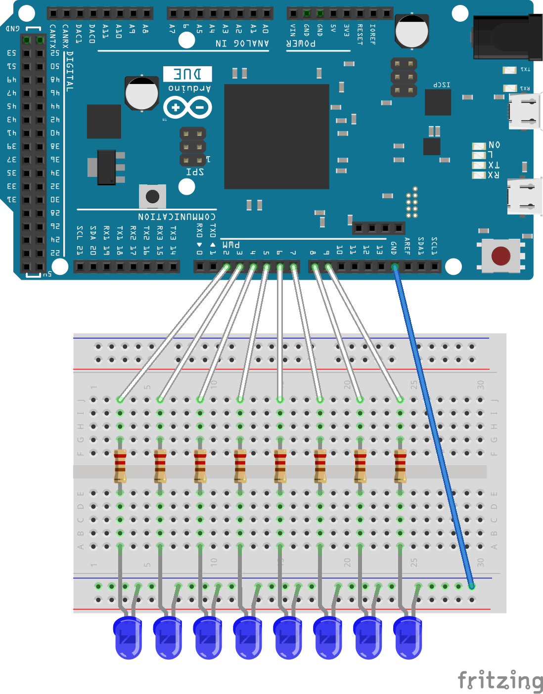

Binary Counting using Arduino and LEDs
=====

This repository is a quick example on how the binary system works. It shows numbers from 0-255 using 8 LEDs.

Required Parts
=====
* **1** Arduino (With **8** outputs)
* **1** Breadboard
* **9** Wires
* **8** Resistors (220 Ω)

Structure
=====

Code
=====
When finished with the building, open the `src/main.c` file and simply copy 'n paste it into your Arduino IDE. Next, hit `Ctrl+Shift+N` in your Arduino IDE and copy the source code from `include/types.h` into that file, and save it as `types.h`. Now upload it to your Arduino and that's it - everything done!

Running on the Arduino
=====
After you've uploaded your freshly compiled program, the 8 LEDs should light up sequentially (250ms delay) and stay on for half a second. Now the LEDs will be turned of and the program starts counting with the `most significant bit` on the left from 0 to 255 until you stop it (It counts from right to left). Have fun!